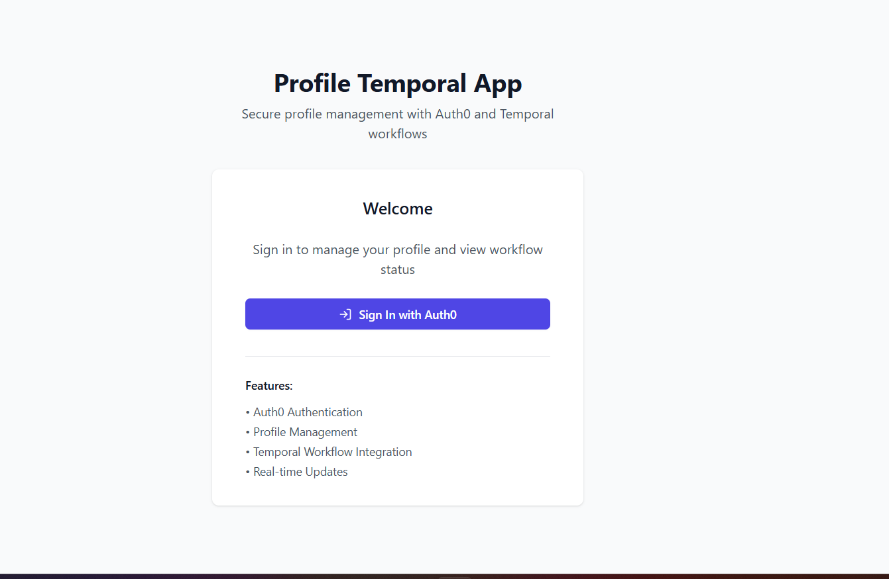
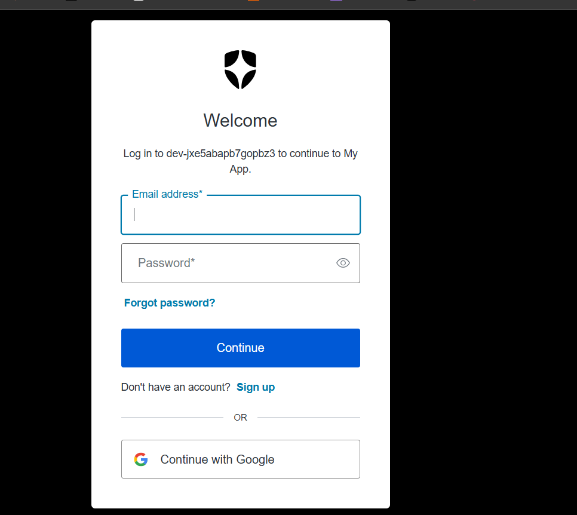
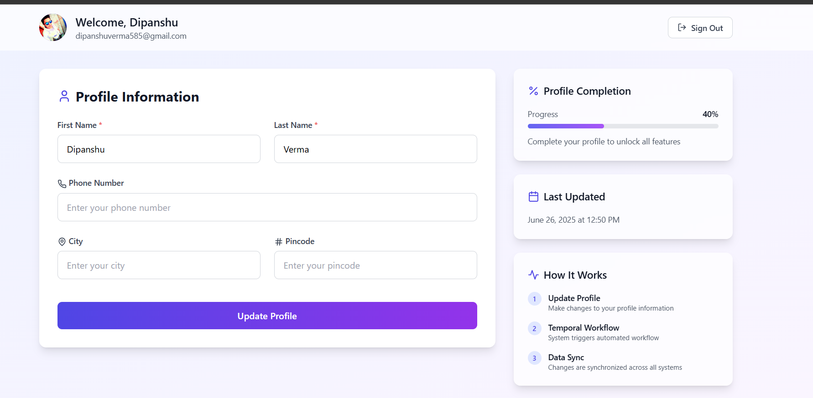
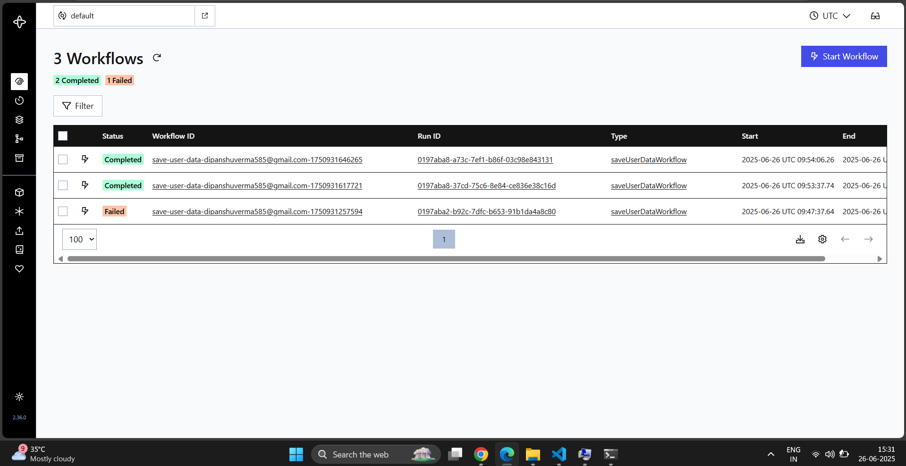
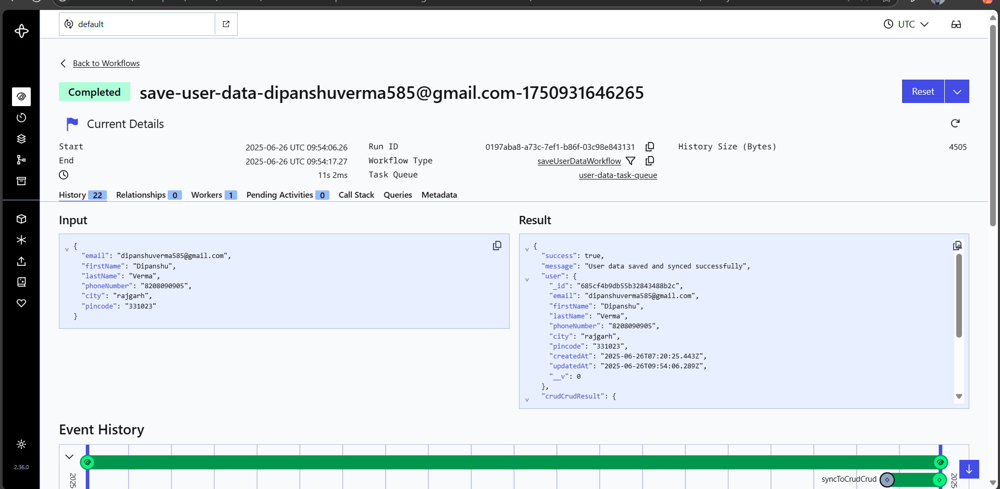

# Profile Management Application with Temporal Integration

A full-stack application that allows users to log in via OIDC (OAuth), view and edit their profile information, with changes synchronized to an external API using Temporal workflow orchestration.

## 📋 Features

- **OAuth Authentication**: Secure login using identity federation (OIDC)
- **Profile Management**: View and edit personal information
- **Real-time Database Updates**: Immediate persistence to MongoDB
- **Delayed External Sync**: Updates to external API (crudcrud.com) with a 10-second delay using Temporal workflows
- **Responsive UI**: Modern, mobile-friendly interface

## 🖼️ Screenshots

### Home Page

*Landing page with login option*

### Continue with Google Page

*OAuth authentication flow*

### Profile Page

*User profile with editable fields*

### Temporal Workflow UI - Running

*Temporal UI showing a running workflow*

### Temporal Workflow UI - Completed

*Temporal UI showing a completed workflow*

## 🔧 Technology Stack

### Frontend
- React.js
- React Router
- Auth0 for authentication
- Tailwind CSS for styling
- Axios for API calls

### Backend
- Node.js & Express
- MongoDB with Mongoose
- Temporal.io for workflow orchestration
- Auth0 for identity federation

## 🏗️ Architecture

The application follows a modern web architecture:

1. **Frontend**: React SPA with client-side routing
2. **API Layer**: Express.js REST API
3. **Database**: MongoDB for persistent storage
4. **Workflow Engine**: Temporal.io for managing delayed external updates
5. **External Integration**: crudcrud.com as the external API

## 🌊 Workflow Explanation

When a user updates their profile:

1. Data is immediately saved to MongoDB
2. A Temporal workflow is initiated
3. The workflow waits for 10 seconds
4. After the delay, the workflow updates the external API (crudcrud.com)

This demonstrates the power of Temporal for handling time-based operations and ensuring reliable execution of sequential tasks.

## 🚀 Installation and Setup

### Prerequisites
- Node.js (v14+)
- MongoDB instance
- Temporal server
- Auth0 account
- crudcrud.com API key

### Installation

1. Clone the repository
```bash
git clone https://github.com/yourusername/profile-temporal-app.git
cd profile-temporal-app